```python
#Etape 1 : Importation et examen du dataset
#importation des bibiliotheques necessaires 
##renommer le fichier de la prof "dataset1"
import pandas as pd
import matplotlib.pyplot as plt
import seaborn as sns
```


```python
# Chargement du dataset
dataset = pd.read_csv('dataset1.csv')
```


```python
# Affichage des premières lignes du dataset
print(dataset.head())
```

         ID       Age             Name              Address         Phone  \
    0  ID_1       NaN  Charlie Johnson                  NaN           NaN   
    1     2       NaN  Charlie Johnson              Unknown  kyg-ftj-dxsb   
    2  ID_3  29 years     None Johnson              Unknown  519-338-6275   
    3   NaN       NaN     Eve Williams  7680 qiweuuyxxy St.           NaN   
    4  ID_5  45 years     Charlie None  1322 lfwzasoxca St.           NaN   
    
                  Email Employee_Infos                Infos  
    0  wtbgnexample.com      Join_Date  2013-06-12 00:00:00  
    1    hgnhe@mail.com      Join_Date                  NaN  
    2    sgxbv@mail.com      Join_Date                  NaN  
    3        lbjps@.com      Join_Date  2014-11-29 00:00:00  
    4               NaN      Join_Date  2012-11-05 00:00:00  


```python
#infos génerales sur notre data set :
print(dataset.info())
```

    <class 'pandas.core.frame.DataFrame'>
    RangeIndex: 40000 entries, 0 to 39999
    Data columns (total 8 columns):
     #   Column          Non-Null Count  Dtype 
    ---  ------          --------------  ----- 
     0   ID              26860 non-null  object
     1   Age             31736 non-null  object
     2   Name            40000 non-null  object
     3   Address         30284 non-null  object
     4   Phone           29868 non-null  object
     5   Email           30000 non-null  object
     6   Employee_Infos  40000 non-null  object
     7   Infos           31174 non-null  object
    dtypes: object(8)
    memory usage: 2.4+ MB
    None


```python
# Afficher des statistiques descriptives
print("Statistiques descriptives du dataset :")
print(dataset.describe())

##on remarque que les variables sont .......
```

    Statistiques descriptives du dataset :
               ID      Age      Name  Address    Phone             Email  \
    count   26860    31736     40000    30284    29868             30000   
    unique   6715      106      3530     5013     4878              7500   
    top      ID_1  Unknown  Bob None  Unknown  Unknown  wtbgnexample.com   
    freq        4     7864       848    10236    10360                 4   
    
           Employee_Infos    Infos  
    count           40000    31174  
    unique              4     9072  
    top         Join_Date  Unknown  
    freq            10000     5721  


```python
#Etape 2 : Nettoyage des donnéees
#IDENTIFICATION DES VALEURS MANQUANTES en %  
valeurs_manquantes = (dataset.isna().sum() / len(dataset) * 100).round(1)
print(valeurs_manquantes)
```

    ID                32.8
    Age               20.7
    Name               0.0
    Address           24.3
    Phone             25.3
    Email             25.0
    Employee_Infos     0.0
    Infos             22.1
    dtype: float64


```python
##1. Nettoyage de la variable âge
# Extraire uniquement les chiffres de la colonne 'Age' , création d'une nouvelle colonne
dataset = pd.read_csv('dataset1.csv')
dataset['Age_numeric'] = dataset['Age'].str.extract('(\d+)')
dataset['Age_numeric'] = dataset['Age_numeric'].astype(float)
print(dataset.head())
```

         ID       Age             Name              Address         Phone  \
    0  ID_1       NaN  Charlie Johnson                  NaN           NaN   
    1     2       NaN  Charlie Johnson              Unknown  kyg-ftj-dxsb   
    2  ID_3  29 years     None Johnson              Unknown  519-338-6275   
    3   NaN       NaN     Eve Williams  7680 qiweuuyxxy St.           NaN   
    4  ID_5  45 years     Charlie None  1322 lfwzasoxca St.           NaN   
    
                  Email Employee_Infos                Infos  Age_numeric  
    0  wtbgnexample.com      Join_Date  2013-06-12 00:00:00          NaN  
    1    hgnhe@mail.com      Join_Date                  NaN          NaN  
    2    sgxbv@mail.com      Join_Date                  NaN         29.0  
    3        lbjps@.com      Join_Date  2014-11-29 00:00:00          NaN  
    4               NaN      Join_Date  2012-11-05 00:00:00         45.0  


```python
#traitement des valeurs manquantes
#Pour faire un choix on observe la distribution de la variable "âge". 
#Si les données sont symétriques et ne contiennent pas de valeurs extrêmes, la moyenne est appropriée. Sinon la médiane est préférée

plt.hist(dataset['Age_numeric'], bins=10, edgecolor='pink')
plt.title('Distribution des âges')
plt.xlabel('Âge')
plt.ylabel('Fréquence')
plt.grid(True)
plt.show()

##distribution assez symétrique
```


    
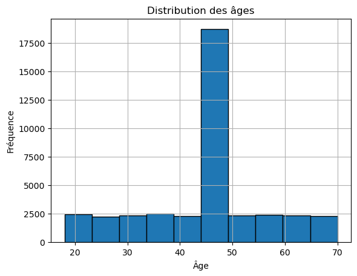
    


```python
##remplace les NA par la médiane
median_age = dataset['Age_numeric'].median()
print(median_age)

dataset['Age_numeric'].fillna(median_age, inplace=True)
```

    44.0


```python
##distibution de l'age apres nettoyage
plt.hist(dataset['Age_numeric'].dropna(), bins=10, edgecolor='black')
plt.title('Distribution des âges')
plt.xlabel('Âge')
plt.ylabel('Fréquence')
plt.grid(True)
plt.show()
```


    

    


```python
##boite à moustache
plt.figure(figsize=(10, 6))
sns.boxplot(x=dataset['Age_numeric'])
plt.title('Box plot des âges')
plt.xlabel('Âge')
plt.show()

##Stat descrptives 
stat=dataset["Age_numeric"].describe()
stat

##age minimum 18ans, age max 70 ans 
##25 % des âges sont inférieurs à 39 ans et 75 % sont inférieurs à 48 ans
##ajorité des âges dans le dataset entre 39 et 48 ans avec une médiane de 44 ans
##ecart type de 11
```


    
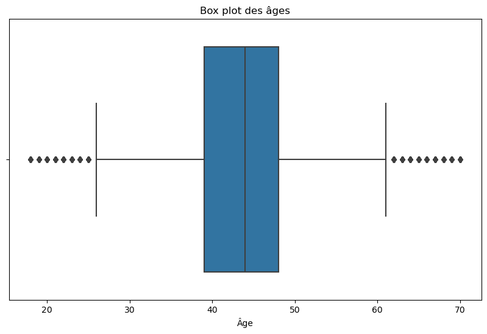
    


    count    40000.000000
    mean        43.942300
    std         11.473694
    min         18.000000
    25%         39.000000
    50%         44.000000
    75%         48.000000
    max         70.000000
    Name: Age_numeric, dtype: float64


```python
#variable Name
# Remplir les valeurs manquantes
dataset["Name"] = dataset["Name"].fillna("Unknown")

```


```python
# Standardiser le format (première lettre en majuscule)
dataset["Name"] = dataset["Name"].str.title()

```


```python
# Vérifier le résultat
print(dataset.head())

```

         ID       Age             Name              Address         Phone  \
    0  ID_1       NaN  Charlie Johnson                  NaN           NaN   
    1     2       NaN  Charlie Johnson              Unknown  kyg-ftj-dxsb   
    2  ID_3  29 years     None Johnson              Unknown  519-338-6275   
    3   NaN       NaN     Eve Williams  7680 qiweuuyxxy St.           NaN   
    4  ID_5  45 years     Charlie None  1322 lfwzasoxca St.           NaN   
    
                  Email Employee_Infos                Infos  Age_numeric  
    0  wtbgnexample.com      Join_Date  2013-06-12 00:00:00         44.0  
    1    hgnhe@mail.com      Join_Date                  NaN         44.0  
    2    sgxbv@mail.com      Join_Date                  NaN         29.0  
    3        lbjps@.com      Join_Date  2014-11-29 00:00:00         44.0  
    4               NaN      Join_Date  2012-11-05 00:00:00         45.0  


```python
#vérifier la validité des mails grâce au symbole @
dataset["Email"] = dataset["Email"].fillna("Unknown")
dataset["Email"] = dataset["Email"].apply(lambda x: x if "@" in x else "invalide")
print(dataset.head())
```

         ID       Age             Name              Address         Phone  \
    0  ID_1       NaN  Charlie Johnson                  NaN           NaN   
    1     2       NaN  Charlie Johnson              Unknown  kyg-ftj-dxsb   
    2  ID_3  29 years     None Johnson              Unknown  519-338-6275   
    3   NaN       NaN     Eve Williams  7680 qiweuuyxxy St.           NaN   
    4  ID_5  45 years     Charlie None  1322 lfwzasoxca St.           NaN   
    
                Email Employee_Infos                Infos  Age_numeric  
    0        invalide      Join_Date  2013-06-12 00:00:00         44.0  
    1  hgnhe@mail.com      Join_Date                  NaN         44.0  
    2  sgxbv@mail.com      Join_Date                  NaN         29.0  
    3      lbjps@.com      Join_Date  2014-11-29 00:00:00         44.0  
    4        invalide      Join_Date  2012-11-05 00:00:00         45.0  


```python
##variable Phone
# Remplir les valeurs manquantes
remplace_num = dataset["Phone"].fillna("Unknown")
remplace_num
```


    0             Unknown
    1        kyg-ftj-dxsb
    2        519-338-6275
    3             Unknown
    4             Unknown
                 ...     
    39995         Unknown
    39996    rkn-iwu-allg
    39997         Unknown
    39998    133-446-1724
    39999    zeg-jip-aucz
    Name: Phone, Length: 40000, dtype: object


```python
##validation des num 

def numvalid(phone):
    phone = str(phone)
    if all(c.isdigit() or c == '-' for c in phone):
        return phone
    else:
        return "invalide"

```


```python
# Appliquer la validation sur la colonne Phone
dataset["Phone"] = dataset["Phone"].apply(numvalid)
dataset.head()
```


<div>
<style scoped>
    .dataframe tbody tr th:only-of-type {
        vertical-align: middle;
    }

    .dataframe tbody tr th {
        vertical-align: top;
    }

    .dataframe thead th {
        text-align: right;
    }
</style>
<table border="1" class="dataframe">
  <thead>
    <tr style="text-align: right;">
      <th></th>
      <th>ID</th>
      <th>Age</th>
      <th>Name</th>
      <th>Address</th>
      <th>Phone</th>
      <th>Email</th>
      <th>Employee_Infos</th>
      <th>Infos</th>
      <th>Age_numeric</th>
    </tr>
  </thead>
  <tbody>
    <tr>
      <th>0</th>
      <td>ID_1</td>
      <td>NaN</td>
      <td>Charlie Johnson</td>
      <td>NaN</td>
      <td>invalide</td>
      <td>invalide</td>
      <td>Join_Date</td>
      <td>2013-06-12 00:00:00</td>
      <td>44.0</td>
    </tr>
    <tr>
      <th>1</th>
      <td>2</td>
      <td>NaN</td>
      <td>Charlie Johnson</td>
      <td>Unknown</td>
      <td>invalide</td>
      <td>hgnhe@mail.com</td>
      <td>Join_Date</td>
      <td>NaN</td>
      <td>44.0</td>
    </tr>
    <tr>
      <th>2</th>
      <td>ID_3</td>
      <td>29 years</td>
      <td>None Johnson</td>
      <td>Unknown</td>
      <td>519-338-6275</td>
      <td>sgxbv@mail.com</td>
      <td>Join_Date</td>
      <td>NaN</td>
      <td>29.0</td>
    </tr>
    <tr>
      <th>3</th>
      <td>NaN</td>
      <td>NaN</td>
      <td>Eve Williams</td>
      <td>7680 qiweuuyxxy St.</td>
      <td>invalide</td>
      <td>lbjps@.com</td>
      <td>Join_Date</td>
      <td>2014-11-29 00:00:00</td>
      <td>44.0</td>
    </tr>
    <tr>
      <th>4</th>
      <td>ID_5</td>
      <td>45 years</td>
      <td>Charlie None</td>
      <td>1322 lfwzasoxca St.</td>
      <td>invalide</td>
      <td>invalide</td>
      <td>Join_Date</td>
      <td>2012-11-05 00:00:00</td>
      <td>45.0</td>
    </tr>
  </tbody>
</table>
</div>


```python
##variable adresse 

##Remplacer les valeurs manquantes
dataset['Address'].fillna('Unknown')
va_manquantes= dataset['Address'].isnull().sum()


# Remplacer les abréviations
dataset['Address'] = dataset['Address'].str.replace('St.', 'STREET')
dataset['Address'] = dataset['Address'].str.replace('Rd.', 'ROAD')
dataset.head()
```


<div>
<style scoped>
    .dataframe tbody tr th:only-of-type {
        vertical-align: middle;
    }

    .dataframe tbody tr th {
        vertical-align: top;
    }

    .dataframe thead th {
        text-align: right;
    }
</style>
<table border="1" class="dataframe">
  <thead>
    <tr style="text-align: right;">
      <th></th>
      <th>ID</th>
      <th>Age</th>
      <th>Name</th>
      <th>Address</th>
      <th>Phone</th>
      <th>Email</th>
      <th>Employee_Infos</th>
      <th>Infos</th>
      <th>Age_numeric</th>
    </tr>
  </thead>
  <tbody>
    <tr>
      <th>0</th>
      <td>ID_1</td>
      <td>NaN</td>
      <td>Charlie Johnson</td>
      <td>NaN</td>
      <td>invalide</td>
      <td>invalide</td>
      <td>Join_Date</td>
      <td>2013-06-12 00:00:00</td>
      <td>44.0</td>
    </tr>
    <tr>
      <th>1</th>
      <td>2</td>
      <td>NaN</td>
      <td>Charlie Johnson</td>
      <td>Unknown</td>
      <td>invalide</td>
      <td>hgnhe@mail.com</td>
      <td>Join_Date</td>
      <td>NaN</td>
      <td>44.0</td>
    </tr>
    <tr>
      <th>2</th>
      <td>ID_3</td>
      <td>29 years</td>
      <td>None Johnson</td>
      <td>Unknown</td>
      <td>519-338-6275</td>
      <td>sgxbv@mail.com</td>
      <td>Join_Date</td>
      <td>NaN</td>
      <td>29.0</td>
    </tr>
    <tr>
      <th>3</th>
      <td>NaN</td>
      <td>NaN</td>
      <td>Eve Williams</td>
      <td>7680 qiweuuyxxy STREET</td>
      <td>invalide</td>
      <td>lbjps@.com</td>
      <td>Join_Date</td>
      <td>2014-11-29 00:00:00</td>
      <td>44.0</td>
    </tr>
    <tr>
      <th>4</th>
      <td>ID_5</td>
      <td>45 years</td>
      <td>Charlie None</td>
      <td>1322 lfwzasoxca STREET</td>
      <td>invalide</td>
      <td>invalide</td>
      <td>Join_Date</td>
      <td>2012-11-05 00:00:00</td>
      <td>45.0</td>
    </tr>
  </tbody>
</table>
</div>


```python
#Convertir les adresses en majuscules
dataset['Address'] = dataset['Address'].str.upper()
```


```python
##variable adresse analyse : trouver la repartition des types de voies (des rues ou des routes)  
#Obj : indentifier 
# Initialiser les compteurs pour "STREET" et "ROAD"
street_count = 0
road_count = 0
```


```python
# Parcourir chaque adresse et compter les occurrences de "STREET" et "ROAD"
for address in dataset['Address']:
    if pd.isna(address):
        continue
    if 'STREET' in address:
        street_count += 1
    if 'ROAD' in address:
        road_count += 1

# Calculer le total des adresses non manquantes
adresse_total = len(dataset) - va_manquantes
adresse_total
```


    30284


```python
##Calcul du pourcentage de chaque type de voie
street_pourcentage = (street_count / adresse_total) * 100
road_pourcentage = (road_count / adresse_total) * 100

#afficher les résultats
adresse_total
street_pourcentage
road_pourcentage


```


    32.94148725399551


```python
##stockage des résultats dans un dataframe

repartition_type_de_voie = pd.DataFrame({
    'Type': ['STREET', 'ROAD'],
    'Count': [street_count, road_count],
    'Percentage': [street_pourcentage, road_pourcentage]
})

print(repartition_type_de_voie)
```

         Type  Count  Percentage
    0  STREET  10076   33.271695
    1    ROAD   9976   32.941487


```python
##résultats paraissent incohérents dnonc vérif sur les adresses non manquantes :
##True (20048) : Ce sont les adresses contenant soit "STREET" soit "ROAD".
##False (10236) : Ce sont les adresses qui ne contiennent ni "STREET" ni "ROAD".

types_d_adresses = dataset['Address'].dropna().apply(lambda x: 'STREET' in x or 'ROAD' in x)
print(types_d_adresses.value_counts())
```

    Address
    True     20048
    False    10236
    Name: count, dtype: int64


```python
##variable employee_infos

# Afficher les premières lignes pour avoir un aperçu
print(dataset['Employee_Infos'].head())

# Vérifier les valeurs manquantes
na_employee_infos = dataset['Employee_Infos'].isna().sum()
na_employee_infos
```

    0    Join_Date
    1    Join_Date
    2    Join_Date
    3    Join_Date
    4    Join_Date
    Name: Employee_Infos, dtype: object


    0


```python
# Afficher des statistiques descriptives pour comprendre la distribution des données
print(dataset['Employee_Infos'].describe())

##aucune valeur manquante dans notre data set et 4 valeurs uniques 
```

    count         40000
    unique            4
    top       Join_Date
    freq          10000
    Name: Employee_Infos, dtype: object


```python
# Analyse des fréquences
infos_comptage = dataset['Employee_Infos'].value_counts()
infos_comptage

```


    Employee_Infos
    Join_Date     10000
    Salary        10000
    Status        10000
    Department    10000
    Name: count, dtype: int64


```python
# Visualisation de la repartition avec un camembert
plt.figure(figsize=(8, 8))
infos_comptage.plot(kind='pie')
plt.title('Répartition des différentes valeurs dans Employee_infos')
plt.ylabel('')
plt.tight_layout()
plt.show()
```


    
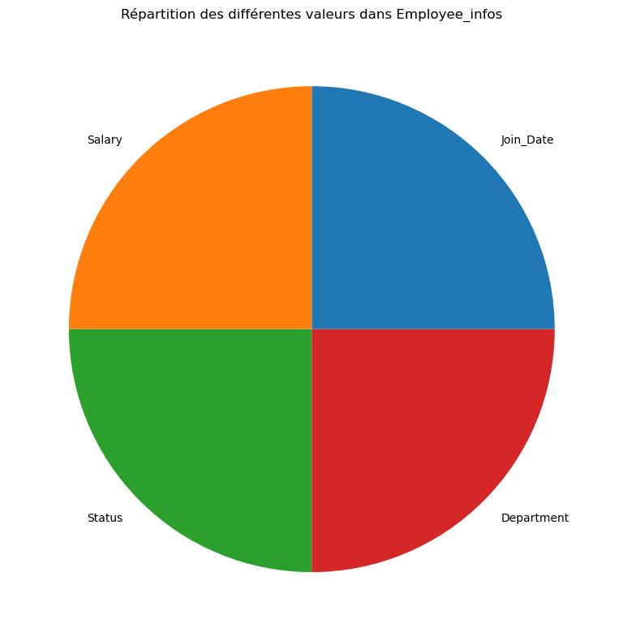
    


```python
##La variable "employee_infos" et infos sont liés et contiennent plusieurs informations :

##La date d'entrée est liée à "join_date".
##Le département (marketing, IT, RH, etc.) est associé à la valeur "department" dans la colonne empyee_infos
##LL'activité (active inactive) est liée au "status".
##LLes salaires en chiffres sont liées aux de la colonne "salary" dans la variable "employee info" toujours. 
##Notre obj est donc d'exploité ces infos mal organisé

import pandas as pd
from datetime import datetime

# Remplacer les valeurs manquantes dans la colonne "Infos" par "unknown"
dataset['Infos'].fillna('unknown', inplace=True)
dataset.head(20)


```


<div>
<style scoped>
    .dataframe tbody tr th:only-of-type {
        vertical-align: middle;
    }

    .dataframe tbody tr th {
        vertical-align: top;
    }

    .dataframe thead th {
        text-align: right;
    }
</style>
<table border="1" class="dataframe">
  <thead>
    <tr style="text-align: right;">
      <th></th>
      <th>ID</th>
      <th>Age</th>
      <th>Name</th>
      <th>Address</th>
      <th>Phone</th>
      <th>Email</th>
      <th>Employee_Infos</th>
      <th>Infos</th>
      <th>Age_numeric</th>
    </tr>
  </thead>
  <tbody>
    <tr>
      <th>0</th>
      <td>ID_1</td>
      <td>NaN</td>
      <td>Charlie Johnson</td>
      <td>NaN</td>
      <td>invalide</td>
      <td>invalide</td>
      <td>Join_Date</td>
      <td>2013-06-12 00:00:00</td>
      <td>44.0</td>
    </tr>
    <tr>
      <th>1</th>
      <td>2</td>
      <td>NaN</td>
      <td>Charlie Johnson</td>
      <td>UNKNOWN</td>
      <td>invalide</td>
      <td>hgnhe@mail.com</td>
      <td>Join_Date</td>
      <td>unknown</td>
      <td>44.0</td>
    </tr>
    <tr>
      <th>2</th>
      <td>ID_3</td>
      <td>29 years</td>
      <td>None Johnson</td>
      <td>UNKNOWN</td>
      <td>519-338-6275</td>
      <td>sgxbv@mail.com</td>
      <td>Join_Date</td>
      <td>unknown</td>
      <td>29.0</td>
    </tr>
    <tr>
      <th>3</th>
      <td>NaN</td>
      <td>NaN</td>
      <td>Eve Williams</td>
      <td>7680 QIWEUUYXXY STREET</td>
      <td>invalide</td>
      <td>lbjps@.com</td>
      <td>Join_Date</td>
      <td>2014-11-29 00:00:00</td>
      <td>44.0</td>
    </tr>
    <tr>
      <th>4</th>
      <td>ID_5</td>
      <td>45 years</td>
      <td>Charlie None</td>
      <td>1322 LFWZASOXCA STREET</td>
      <td>invalide</td>
      <td>invalide</td>
      <td>Join_Date</td>
      <td>2012-11-05 00:00:00</td>
      <td>45.0</td>
    </tr>
    <tr>
      <th>5</th>
      <td>6</td>
      <td>22 years</td>
      <td>Kidwjexydw Jones</td>
      <td>BWZVEYFXXJ ROAD</td>
      <td>invalide</td>
      <td>invalide</td>
      <td>Join_Date</td>
      <td>2023-06-26 00:00:00</td>
      <td>22.0</td>
    </tr>
    <tr>
      <th>6</th>
      <td>ID_7</td>
      <td>18</td>
      <td>Bob Johnson</td>
      <td>4853 RNEKXBCEIZ STREET</td>
      <td>373-343-8002</td>
      <td>invalide</td>
      <td>Join_Date</td>
      <td>1/2/2013</td>
      <td>18.0</td>
    </tr>
    <tr>
      <th>7</th>
      <td>NaN</td>
      <td>56 years</td>
      <td>None Brown</td>
      <td>UNKNOWN</td>
      <td>invalide</td>
      <td>invalide</td>
      <td>Join_Date</td>
      <td>unknown</td>
      <td>56.0</td>
    </tr>
    <tr>
      <th>8</th>
      <td>9</td>
      <td>52 years</td>
      <td>None None</td>
      <td>TBKXAJOQQR ROAD</td>
      <td>invalide</td>
      <td>dkbka@test.com</td>
      <td>Join_Date</td>
      <td>2011-06-30 00:00:00</td>
      <td>52.0</td>
    </tr>
    <tr>
      <th>9</th>
      <td>ID_10</td>
      <td>47 years</td>
      <td>Eve Brown</td>
      <td>NaN</td>
      <td>invalide</td>
      <td>aqkgo@.com</td>
      <td>Join_Date</td>
      <td>7/22/2015</td>
      <td>47.0</td>
    </tr>
    <tr>
      <th>10</th>
      <td>NaN</td>
      <td>61 years</td>
      <td>Alice Brown</td>
      <td>819 STHZYJCTUE STREET</td>
      <td>invalide</td>
      <td>invalide</td>
      <td>Join_Date</td>
      <td>2023-07-06 00:00:00</td>
      <td>61.0</td>
    </tr>
    <tr>
      <th>11</th>
      <td>NaN</td>
      <td>61 years</td>
      <td>David Williams</td>
      <td>UNKNOWN</td>
      <td>invalide</td>
      <td>mpxxf@example.com</td>
      <td>Join_Date</td>
      <td>unknown</td>
      <td>61.0</td>
    </tr>
    <tr>
      <th>12</th>
      <td>13</td>
      <td>NaN</td>
      <td>Charlie Jones</td>
      <td>UNKNOWN</td>
      <td>invalide</td>
      <td>evcwt@test.com</td>
      <td>Join_Date</td>
      <td>unknown</td>
      <td>44.0</td>
    </tr>
    <tr>
      <th>13</th>
      <td>NaN</td>
      <td>66 years</td>
      <td>Charlie None</td>
      <td>2020 GFMYKHDFLG STREET</td>
      <td>invalide</td>
      <td>invalide</td>
      <td>Join_Date</td>
      <td>2017-01-13 00:00:00</td>
      <td>66.0</td>
    </tr>
    <tr>
      <th>14</th>
      <td>15</td>
      <td>Unknown</td>
      <td>Alice Lzhlesykhw</td>
      <td>UNKNOWN</td>
      <td>invalide</td>
      <td>invalide</td>
      <td>Join_Date</td>
      <td>unknown</td>
      <td>44.0</td>
    </tr>
    <tr>
      <th>15</th>
      <td>NaN</td>
      <td>35 years</td>
      <td>Eve Omljzjgzxv</td>
      <td>8900 CMUCKPALWO STREET</td>
      <td>invalide</td>
      <td>piumn@example.com</td>
      <td>Join_Date</td>
      <td>unknown</td>
      <td>35.0</td>
    </tr>
    <tr>
      <th>16</th>
      <td>NaN</td>
      <td>18</td>
      <td>Eve Williams</td>
      <td>9735 FVSTZYNTBA STREET</td>
      <td>invalide</td>
      <td>tucua@.com</td>
      <td>Join_Date</td>
      <td>2012-10-14 00:00:00</td>
      <td>18.0</td>
    </tr>
    <tr>
      <th>17</th>
      <td>NaN</td>
      <td>NaN</td>
      <td>Eve Williams</td>
      <td>7731 SAONOBADBP STREET</td>
      <td>invalide</td>
      <td>invalide</td>
      <td>Join_Date</td>
      <td>6/18/2014</td>
      <td>44.0</td>
    </tr>
    <tr>
      <th>18</th>
      <td>19</td>
      <td>22 years</td>
      <td>David Jones</td>
      <td>4514 NZNQZARZMI STREET</td>
      <td>invalide</td>
      <td>invalide</td>
      <td>Join_Date</td>
      <td>8/13/2023</td>
      <td>22.0</td>
    </tr>
    <tr>
      <th>19</th>
      <td>20</td>
      <td>Unknown</td>
      <td>Pwsehvilup Williams</td>
      <td>5669 IXSWXWBWEF STREET</td>
      <td>invalide</td>
      <td>twqwu@example.com</td>
      <td>Join_Date</td>
      <td>unknown</td>
      <td>44.0</td>
    </tr>
  </tbody>
</table>
</div>


```python
import re

# Fonction pour extraire les dates
def extract_dates(Infos):
    date_pattern = re.compile(r'\b\d{1,2}/\d{1,2}/\d{4}\b')  # Format : dd/mm/yyyy
    dates = date_pattern.findall(Infos)
    return dates[0] if dates else None

```


```python
# Appliquer la fonction à la colonne 'infos' et créer une nouvelle colonne 'info_date'
dataset['info_date'] = dataset['Infos'].apply(extract_dates)

# Afficher les premières lignes pour vérifier le résultat
print(dataset.head())

##extraction excel pour vérifier si ce que j'ai fait été ok 
output_file = 'cleaned_dataset.xlsx'
dataset.to_excel(output_file, index=False)

#
```

         ID       Age             Name                 Address         Phone  \
    0  ID_1       NaN  Charlie Johnson                     NaN      invalide   
    1     2       NaN  Charlie Johnson                 UNKNOWN      invalide   
    2  ID_3  29 years     None Johnson                 UNKNOWN  519-338-6275   
    3   NaN       NaN     Eve Williams  7680 QIWEUUYXXY STREET      invalide   
    4  ID_5  45 years     Charlie None  1322 LFWZASOXCA STREET      invalide   
    
                Email Employee_Infos                Infos  Age_numeric info_date  
    0        invalide      Join_Date  2013-06-12 00:00:00         44.0      None  
    1  hgnhe@mail.com      Join_Date              unknown         44.0      None  
    2  sgxbv@mail.com      Join_Date              unknown         29.0      None  
    3      lbjps@.com      Join_Date  2014-11-29 00:00:00         44.0      None  
    4        invalide      Join_Date  2012-11-05 00:00:00         45.0      None  


```python

```


```python
##On isole les infos sur le secteur d'activite et le statut d'acrivité dans deux colonnes distincts 

dataset['Department'] = dataset['Infos'].str.extract(r'(Finance|HR|IT|Marketing)')
dataset['Status'] = dataset['Infos'].str.extract(r'(Active|Inactive)')


```


```python
#Extraire les salaires avec le symbole $ suivi d'un chiffre et créer la nouvelle colonne Salaire
dataset['Salary'] = dataset['Infos'].str.extract(r'\$(\d+)')

# Convertir les salaires en valeurs numériques
dataset['Salary'] = pd.to_numeric(dataset['Salary'])
dataset

```


<div>
<style scoped>
    .dataframe tbody tr th:only-of-type {
        vertical-align: middle;
    }

    .dataframe tbody tr th {
        vertical-align: top;
    }

    .dataframe thead th {
        text-align: right;
    }
</style>
<table border="1" class="dataframe">
  <thead>
    <tr style="text-align: right;">
      <th></th>
      <th>ID</th>
      <th>Age</th>
      <th>Name</th>
      <th>Address</th>
      <th>Phone</th>
      <th>Email</th>
      <th>Employee_Infos</th>
      <th>Infos</th>
      <th>Age_numeric</th>
      <th>info_date</th>
      <th>Department</th>
      <th>Status</th>
      <th>Salary</th>
    </tr>
  </thead>
  <tbody>
    <tr>
      <th>0</th>
      <td>ID_1</td>
      <td>NaN</td>
      <td>Charlie Johnson</td>
      <td>NaN</td>
      <td>invalide</td>
      <td>invalide</td>
      <td>Join_Date</td>
      <td>2013-06-12 00:00:00</td>
      <td>44.0</td>
      <td>None</td>
      <td>NaN</td>
      <td>NaN</td>
      <td>NaN</td>
    </tr>
    <tr>
      <th>1</th>
      <td>2</td>
      <td>NaN</td>
      <td>Charlie Johnson</td>
      <td>UNKNOWN</td>
      <td>invalide</td>
      <td>hgnhe@mail.com</td>
      <td>Join_Date</td>
      <td>unknown</td>
      <td>44.0</td>
      <td>None</td>
      <td>NaN</td>
      <td>NaN</td>
      <td>NaN</td>
    </tr>
    <tr>
      <th>2</th>
      <td>ID_3</td>
      <td>29 years</td>
      <td>None Johnson</td>
      <td>UNKNOWN</td>
      <td>519-338-6275</td>
      <td>sgxbv@mail.com</td>
      <td>Join_Date</td>
      <td>unknown</td>
      <td>29.0</td>
      <td>None</td>
      <td>NaN</td>
      <td>NaN</td>
      <td>NaN</td>
    </tr>
    <tr>
      <th>3</th>
      <td>NaN</td>
      <td>NaN</td>
      <td>Eve Williams</td>
      <td>7680 QIWEUUYXXY STREET</td>
      <td>invalide</td>
      <td>lbjps@.com</td>
      <td>Join_Date</td>
      <td>2014-11-29 00:00:00</td>
      <td>44.0</td>
      <td>None</td>
      <td>NaN</td>
      <td>NaN</td>
      <td>NaN</td>
    </tr>
    <tr>
      <th>4</th>
      <td>ID_5</td>
      <td>45 years</td>
      <td>Charlie None</td>
      <td>1322 LFWZASOXCA STREET</td>
      <td>invalide</td>
      <td>invalide</td>
      <td>Join_Date</td>
      <td>2012-11-05 00:00:00</td>
      <td>45.0</td>
      <td>None</td>
      <td>NaN</td>
      <td>NaN</td>
      <td>NaN</td>
    </tr>
    <tr>
      <th>...</th>
      <td>...</td>
      <td>...</td>
      <td>...</td>
      <td>...</td>
      <td>...</td>
      <td>...</td>
      <td>...</td>
      <td>...</td>
      <td>...</td>
      <td>...</td>
      <td>...</td>
      <td>...</td>
      <td>...</td>
    </tr>
    <tr>
      <th>39995</th>
      <td>ID_9996</td>
      <td>41 years</td>
      <td>David Williams</td>
      <td>1457 GKGMPXHTCC STREET</td>
      <td>invalide</td>
      <td>invalide</td>
      <td>Department</td>
      <td>unknown</td>
      <td>41.0</td>
      <td>None</td>
      <td>NaN</td>
      <td>NaN</td>
      <td>NaN</td>
    </tr>
    <tr>
      <th>39996</th>
      <td>ID_9997</td>
      <td>63 years</td>
      <td>Charlie None</td>
      <td>TGSJMEZPIV ROAD</td>
      <td>invalide</td>
      <td>wztox@test.com</td>
      <td>Department</td>
      <td>Unknown</td>
      <td>63.0</td>
      <td>None</td>
      <td>NaN</td>
      <td>NaN</td>
      <td>NaN</td>
    </tr>
    <tr>
      <th>39997</th>
      <td>9998</td>
      <td>69</td>
      <td>Alice Johnson</td>
      <td>UNKNOWN</td>
      <td>invalide</td>
      <td>ngyxt@.com</td>
      <td>Department</td>
      <td>HR</td>
      <td>69.0</td>
      <td>None</td>
      <td>HR</td>
      <td>NaN</td>
      <td>NaN</td>
    </tr>
    <tr>
      <th>39998</th>
      <td>ID_9999</td>
      <td>NaN</td>
      <td>None Williams</td>
      <td>QBJVKVBUBZ ROAD</td>
      <td>133-446-1724</td>
      <td>jprco@mail.com</td>
      <td>Department</td>
      <td>Marketing</td>
      <td>44.0</td>
      <td>None</td>
      <td>Marketing</td>
      <td>NaN</td>
      <td>NaN</td>
    </tr>
    <tr>
      <th>39999</th>
      <td>10000</td>
      <td>NaN</td>
      <td>Alice Dglbvadihn</td>
      <td>TKEAUFZRCY ROAD</td>
      <td>invalide</td>
      <td>invalide</td>
      <td>Department</td>
      <td>Unknown</td>
      <td>44.0</td>
      <td>None</td>
      <td>NaN</td>
      <td>NaN</td>
      <td>NaN</td>
    </tr>
  </tbody>
</table>
<p>40000 rows × 13 columns</p>
</div>


```python
##Analyse de ns nouvelles variables 
# graphique de la répartition par département

# Calculer la répartition par département
departement_distribution = dataset['Department'].value_counts()

# Afficher la répartition exacte
print(departement_distribution)

# Tracer le graphique avec les nombres exacts par secteur d'activité
plt.figure(figsize=(10, 6))
departement_distribution.plot(kind='bar', color='pink')
plt.title('Répartition des employés par département')
plt.xlabel('Département')
plt.ylabel("Nombre d'employés")
plt.xticks(rotation=45)
plt.tight_layout()

# Ajouter les nombres exacts au-dessus des barres
for index, value in enumerate(departement_distribution):
    plt.text(index, value + 10, str(value), ha='center')
plt.show()

```

    Department
    HR           1678
    Finance      1653
    IT           1651
    Marketing    1647
    Name: count, dtype: int64


    
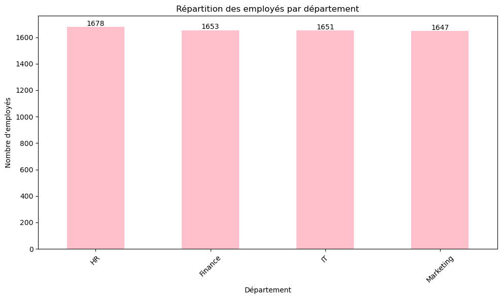
    


```python
##repartition des salaires par âge
plt.figure(figsize=(10, 6))
sns.boxplot(x='Age_numeric', y='Salary', data=dataset)
plt.title('Répartition des salaires par département')
plt.xticks(rotation=90)
plt.show()


```


    
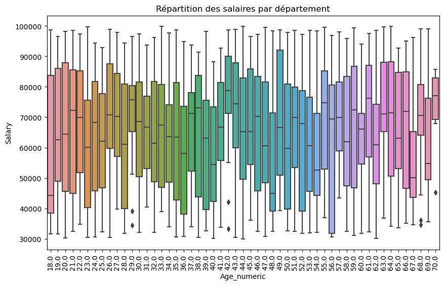
    


```python

##pas assez visuel donc autre visualisation 

# Nuage de point avec ligne de tendance
plt.figure(figsize=(10, 6))
sns.scatterplot(x='Age_numeric', y='Salary', data=dataset)
sns.regplot(x='Age_numeric', y='Salary', data=dataset, scatter=False, color='red')
plt.title("Scatter plot des salaires par âge avec ligne de tendance")
plt.xlabel("Âge")
plt.ylabel("Salaire")
plt.show()

##montre la dispersion des salaires par âge et souligner l'absence de corrélation forte entre ls 2 variables.


```


    
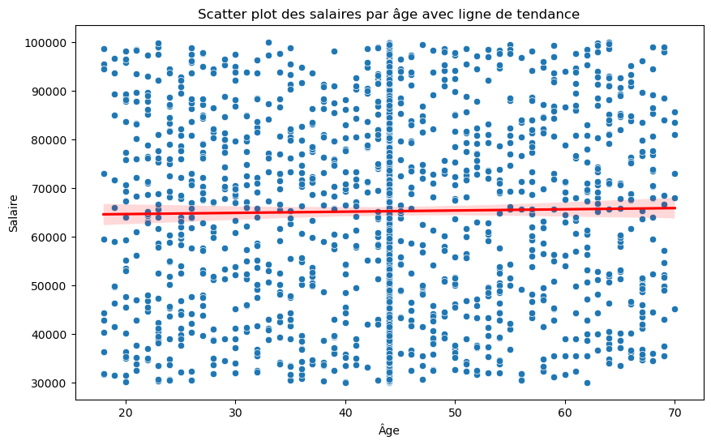
    


```python
##meilleur visualisation 
##histogramme avec groupe d'age 

# Création des groupes d'âge
bins = [18, 25, 35, 45, 55, 65, 75]
labels = ['18-25', '26-35', '36-45', '46-55', '56-65', '66-75']
dataset['AgeGroup'] = pd.cut(dataset['Age_numeric'], bins=bins, labels=labels, right=False)

# Histogramme des salaires par groupe d'âge
plt.figure(figsize=(10, 6))
sns.histplot(data=dataset, x='Salary', hue='AgeGroup', multiple='stack')
plt.title("Histogramme des salaires par groupe d'âge")
plt.xlabel("Salaire")
plt.ylabel("Fréquence")
plt.show()

#Il n'y a pas de lien fort entre l'âge et le salaire, bien que les personnes âgées de
##36 à 55 ans soient les plus nombreuses dans la plupart des tranches de salaire, 
##ce qui montre que les salaires sont assez uniformes pour tous les âges.
```

    C:\Users\BAHF\AppData\Local\anaconda3\Lib\site-packages\seaborn\_oldcore.py:1119: FutureWarning: use_inf_as_na option is deprecated and will be removed in a future version. Convert inf values to NaN before operating instead.
      with pd.option_context('mode.use_inf_as_na', True):
    C:\Users\BAHF\AppData\Local\anaconda3\Lib\site-packages\seaborn\_oldcore.py:1057: FutureWarning: The default of observed=False is deprecated and will be changed to True in a future version of pandas. Pass observed=False to retain current behavior or observed=True to adopt the future default and silence this warning.
      grouped_data = data.groupby(
    C:\Users\BAHF\AppData\Local\anaconda3\Lib\site-packages\seaborn\_oldcore.py:1057: FutureWarning: The default of observed=False is deprecated and will be changed to True in a future version of pandas. Pass observed=False to retain current behavior or observed=True to adopt the future default and silence this warning.
      grouped_data = data.groupby(


    
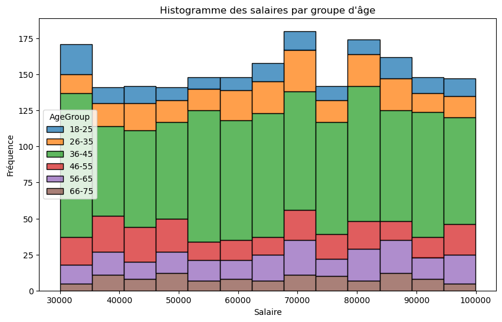
    


```python

```


```python
##Statut d'activité 
# Créer un graphique de répartition par statut d'activité
# Calculer la répartition par statut d'activité
statut_distribution = dataset['Status'].value_counts()

# Afficher la répartition exacte
print(statut_distribution)

# Tracer le graphique avec les nombres exacts
plt.figure(figsize=(10, 6))
statut_distribution.plot(kind='bar', color='violet')
plt.title('Répartition des employés par statut')
plt.xlabel('Status')
plt.ylabel("Nombre d'employés")
plt.xticks(rotation=45)
plt.tight_layout()

# Ajouter les nombres exacts au-dessus des barres
for index, value in enumerate(statut_distribution):
    plt.text(index, value + 10, str(value), ha='center')

plt.show()

```

    Status
    Active      2016
    Inactive    2000
    Name: count, dtype: int64


    
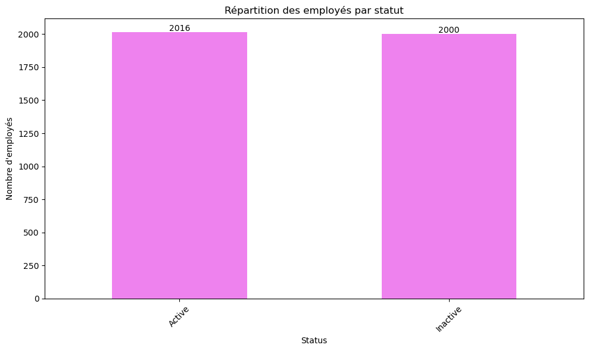
    


```python
##corrélation entre salaire et statut ? 
##répartition des salaires par statut 

plt.figure(figsize=(10, 6))
sns.boxplot(x='Age_numeric', y='Status', data=dataset)
plt.title('Répartition des salaires par statut')
plt.xticks(rotation=90)
plt.show()

```


    
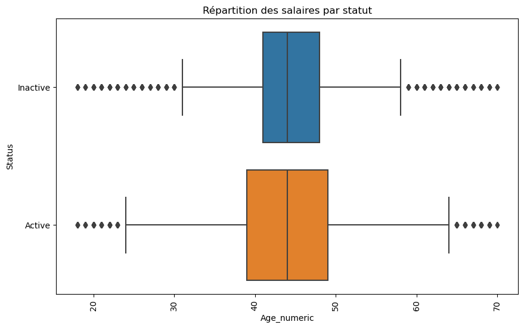
    


```python
## graphique barre empilé pour montrer correlation entre âge et secteur d'activité 

# Calculer la répartition des secteur d'activité par groupe d'âge
distrib_age_statut= pd.crosstab(dataset['AgeGroup'], dataset['Department'], normalize='index')

# Afficher les données préparées pour vérification
print(distrib_age_statut)

distrib_age_statut.plot(kind='bar', stacked=True, figsize=(10, 6), color=sns.color_palette("Set2"))

# Ajouter le titre et les labels
plt.title("Répartition des secteur d'activité par groupe d'âge")
plt.xlabel("Groupe d'âge")
plt.ylabel("Proportion")
plt.legend(title='Statut')
plt.xticks(rotation=45)
plt.tight_layout()

# Afficher le graphique
plt.show()

```

    Department   Finance        HR        IT  Marketing
    AgeGroup                                           
    18-25       0.264940  0.276892  0.233068   0.225100
    26-35       0.244709  0.260582  0.236772   0.257937
    36-45       0.254682  0.242869  0.254394   0.248055
    46-55       0.231417  0.273492  0.245442   0.249649
    56-65       0.221106  0.262563  0.253769   0.262563
    66-75       0.281330  0.242967  0.242967   0.232737


    
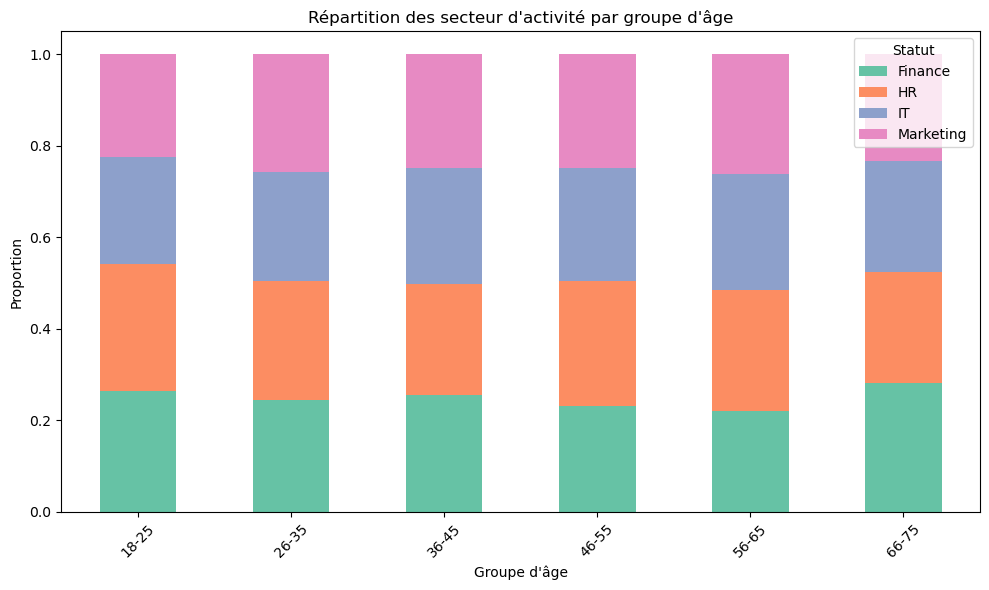
    


    ---------------------------------------------------------------------------

    TypeError                                 Traceback (most recent call last)

    Cell In[136], line 25
         23 # Ajouter les nombres exacts au-dessus des barres
         24 for index, value in enumerate(distrib_age_statut):
    ---> 25     plt.text(index, value + 10, str(value), ha='center')
         26 plt.show()


    TypeError: can only concatenate str (not "int") to str


```python
##on crée une nouvelle colonne ID pour uniformiser 

dataset['New_ID'] = range(1, len(dataset) + 1)
dataset.head()

```


<div>
<style scoped>
    .dataframe tbody tr th:only-of-type {
        vertical-align: middle;
    }

    .dataframe tbody tr th {
        vertical-align: top;
    }

    .dataframe thead th {
        text-align: right;
    }
</style>
<table border="1" class="dataframe">
  <thead>
    <tr style="text-align: right;">
      <th></th>
      <th>ID</th>
      <th>Age</th>
      <th>Name</th>
      <th>Address</th>
      <th>Phone</th>
      <th>Email</th>
      <th>Employee_Infos</th>
      <th>Infos</th>
      <th>Age_numeric</th>
      <th>info_date</th>
      <th>Department</th>
      <th>Status</th>
      <th>Salary</th>
      <th>AgeGroup</th>
      <th>New_ID</th>
    </tr>
  </thead>
  <tbody>
    <tr>
      <th>0</th>
      <td>ID_1</td>
      <td>NaN</td>
      <td>Charlie Johnson</td>
      <td>NaN</td>
      <td>invalide</td>
      <td>invalide</td>
      <td>Join_Date</td>
      <td>2013-06-12 00:00:00</td>
      <td>44.0</td>
      <td>None</td>
      <td>NaN</td>
      <td>NaN</td>
      <td>NaN</td>
      <td>36-45</td>
      <td>1</td>
    </tr>
    <tr>
      <th>1</th>
      <td>2</td>
      <td>NaN</td>
      <td>Charlie Johnson</td>
      <td>UNKNOWN</td>
      <td>invalide</td>
      <td>hgnhe@mail.com</td>
      <td>Join_Date</td>
      <td>unknown</td>
      <td>44.0</td>
      <td>None</td>
      <td>NaN</td>
      <td>NaN</td>
      <td>NaN</td>
      <td>36-45</td>
      <td>2</td>
    </tr>
    <tr>
      <th>2</th>
      <td>ID_3</td>
      <td>29 years</td>
      <td>None Johnson</td>
      <td>UNKNOWN</td>
      <td>519-338-6275</td>
      <td>sgxbv@mail.com</td>
      <td>Join_Date</td>
      <td>unknown</td>
      <td>29.0</td>
      <td>None</td>
      <td>NaN</td>
      <td>NaN</td>
      <td>NaN</td>
      <td>26-35</td>
      <td>3</td>
    </tr>
    <tr>
      <th>3</th>
      <td>NaN</td>
      <td>NaN</td>
      <td>Eve Williams</td>
      <td>7680 QIWEUUYXXY STREET</td>
      <td>invalide</td>
      <td>lbjps@.com</td>
      <td>Join_Date</td>
      <td>2014-11-29 00:00:00</td>
      <td>44.0</td>
      <td>None</td>
      <td>NaN</td>
      <td>NaN</td>
      <td>NaN</td>
      <td>36-45</td>
      <td>4</td>
    </tr>
    <tr>
      <th>4</th>
      <td>ID_5</td>
      <td>45 years</td>
      <td>Charlie None</td>
      <td>1322 LFWZASOXCA STREET</td>
      <td>invalide</td>
      <td>invalide</td>
      <td>Join_Date</td>
      <td>2012-11-05 00:00:00</td>
      <td>45.0</td>
      <td>None</td>
      <td>NaN</td>
      <td>NaN</td>
      <td>NaN</td>
      <td>46-55</td>
      <td>5</td>
    </tr>
  </tbody>
</table>
</div>


```python

```


```python
##nalyse sur les dates de Join_date

dataset['info_date'] = dataset['Infos'].apply(extract_dates)
# Afficher les premières lignes pour vérifier
print(dataset[['Infos', 'info_date']].head())
```

                     Infos info_date
    0  2013-06-12 00:00:00      None
    1              unknown      None
    2              unknown      None
    3  2014-11-29 00:00:00      None
    4  2012-11-05 00:00:00      None


```python
# Vérifier les dates extraites et gérer les valeurs manquantes
dataset['info_date'] = dataset['Infos'].apply(extract_dates)

# Afficher les premières lignes pour vérifier
print(dataset[['Infos', 'info_date']].head())

# Filtrer les lignes avec des dates valides
valid_dates = dataset['info_date'].dropna()

# vérifier
print(valid_dates.head())
```

                     Infos info_date
    0  2013-06-12 00:00:00      None
    1              unknown      None
    2              unknown      None
    3  2014-11-29 00:00:00      None
    4  2012-11-05 00:00:00      None
    6      1/2/2013
    9     7/22/2015
    17    6/18/2014
    18    8/13/2023
    21    7/18/2019
    Name: info_date, dtype: object


```python
##Histogramme distribution des dates, pas visuel du tout 

plt.figure(figsize=(10, 6))
valid_dates.hist(bins=30, color='skyblue')
plt.title('Distribution des dates dans la colonne Infos')
plt.xlabel('Date')
plt.ylabel('Fréquence')
plt.tight_layout()
plt.show()
```


    
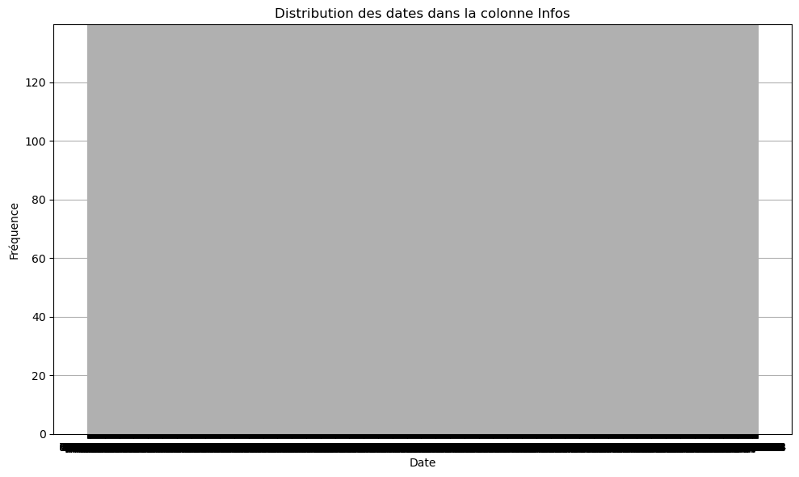
    


```python
##Analyse des tendances d'embauche

# Fonction pour extraire les années des dates de la colonne 'Infos'
def extract_years(Infos):
    date_pattern = re.compile(r'\b\d{1,2}/\d{1,2}/\d{4}\b')  # Format : dd/mm/yyyy
    dates = date_pattern.findall(Infos)
    return pd.to_datetime(dates[0], format='%d/%m/%Y', errors='coerce').year if dates else None

```


```python

# Appliquer la fonction à la colonne 'Infos' et créer une nouvelle colonne 'info_year'
dataset['info_year'] = dataset['Infos'].apply(extract_years)

# Afficher les premières lignes pour vérifier
print(dataset[['Infos', 'info_year']].head())

# Compter le nombre d'employés embauchés chaque année
tendance_embauche = dataset['info_year'].value_counts().sort_index()
tendance_embauche
```

                     Infos  info_year
    0  2013-06-12 00:00:00        NaN
    1              unknown        NaN
    2              unknown        NaN
    3  2014-11-29 00:00:00        NaN
    4  2012-11-05 00:00:00        NaN


    info_year
    2010.0    89
    2011.0    81
    2012.0    81
    2013.0    79
    2014.0    99
    2015.0    74
    2016.0    97
    2017.0    79
    2018.0    78
    2019.0    77
    2020.0    92
    2021.0    85
    2022.0    93
    2023.0    84
    2024.0    88
    Name: count, dtype: int64


```python
#  graphique des tendances d'embauche
plt.figure(figsize=(10, 6))
tendance_embauche.plot(kind='bar', color='skyblue')
plt.title('Tendances d\'embauche par année')
plt.xlabel('Année')
plt.ylabel('Nombre d\'employés embauchés')
plt.xticks(rotation=45)
plt.tight_layout()
plt.show()

## embauche autour de 85 à 93 employés par an.
##des Pics d'Embauche : 2014 et 2016
##baisse d'embauche : 2015 et 2018
```


    
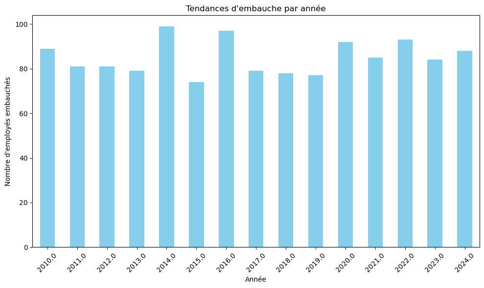
    

